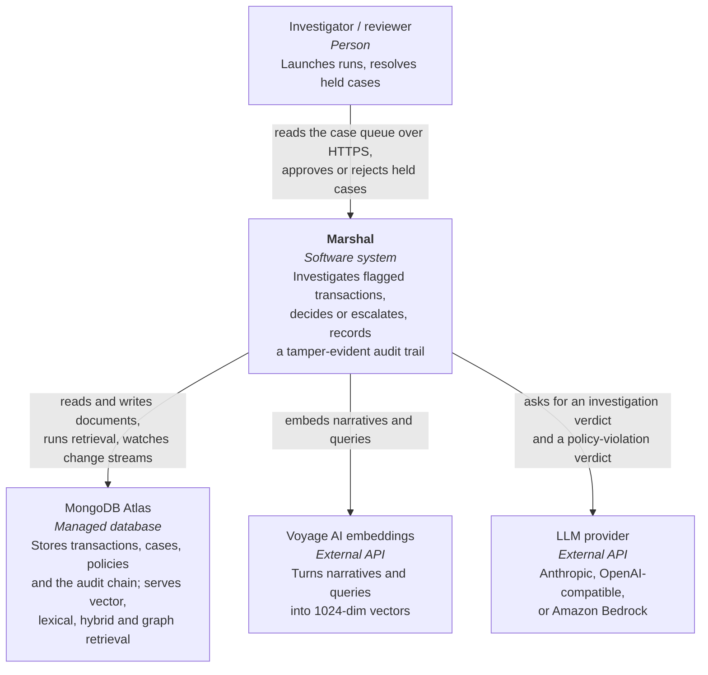
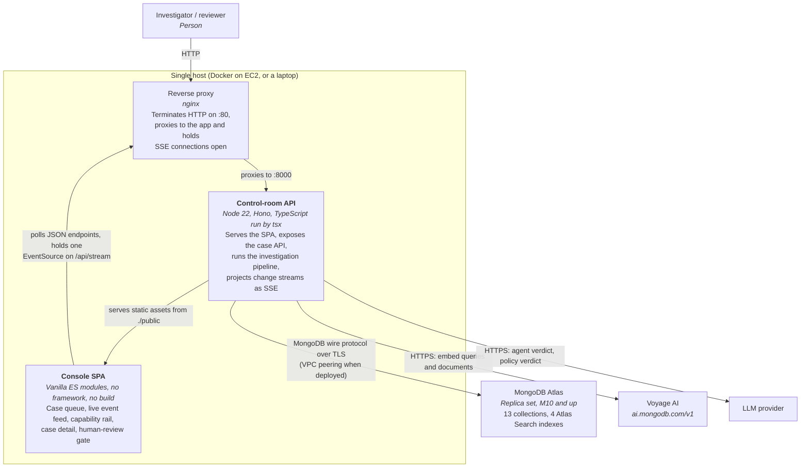
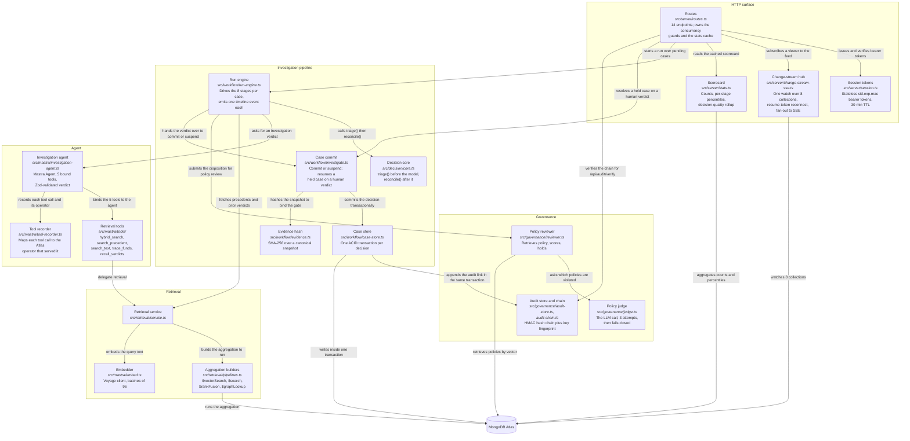
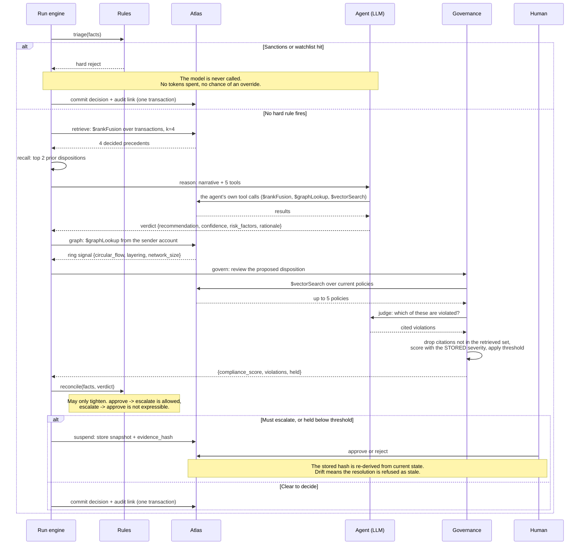

# Architecture

Marshal is an agentic fraud investigation console. A flagged transaction goes in, a decision plus a
signed audit record comes out, and a human reviewer is pulled in whenever the machinery is not
entitled to decide alone.

The interesting property is not that an LLM is involved. It is where the LLM is *not* allowed to be.
Deterministic rules run before the model and after it, the model's policy citations are filtered
against what was actually retrieved, and the final commit is a MongoDB transaction that writes the
decision and its audit link together or neither. The agent contributes judgement. It does not
contribute authority.

Everything the system stores and every retrieval mode it uses lives on one MongoDB Atlas cluster.
There is no second datastore, no vector sidecar, no search cluster, and no queue.

- [Level 1: system context](#level-1-system-context)
- [Level 2: containers](#level-2-containers)
- [Level 3: components inside the API](#level-3-components-inside-the-api)
- [The investigation pipeline](#the-investigation-pipeline)
- [Where the time actually goes](#where-the-time-actually-goes)
- [Load-bearing design commitments](#load-bearing-design-commitments)
- [Live mode and demo mode](#live-mode-and-demo-mode)
- [Known limits](#known-limits)

## Level 1: system context

Two things are worth noticing about this level.

There is exactly one database dependency. Vector search, BM25 lexical search, server-side hybrid
fusion, graph traversal, ACID commits, and the live UI feed are all Atlas features, so the
deployment has one stateful thing to size, secure, back up, and reason about.

The LLM provider is pluggable and the embedding provider is not. `LLM_PROVIDER` chooses between
Anthropic, an OpenAI-compatible endpoint, and Bedrock at startup. The embedding model is a stored
property of the corpus: the vectors in `transactions.embedding` were produced by one model, and
querying them with a different one is not a degradation, it is a different vector space. Changing the
model means re-embedding in the same commit.

## Level 2: containers

There is no build step anywhere in this picture. `tsx` runs the TypeScript sources directly, and the
SPA is three plain ES modules that the browser loads as written. The Dockerfile installs
dependencies and starts the server. That is a deliberate trade: it costs a little startup time and
buys the property that the code running in production is the code in the repository, with no
artifact in between.

The API container holds one long-lived MongoDB change stream and fans it out to every connected
browser. It is not one change stream per viewer. See
[`src/server/change-stream-sse.ts`](../src/server/change-stream-sse.ts).

Provisioning is not in the image. Index creation and seeding run as separate commands
(`pnpm provision`) because they are one-time operations against a shared cluster, and a container
that provisions on boot turns a restart into a schema migration.

## Level 3: components inside the API

The dependency arrows only ever point one way: HTTP surface into pipeline, pipeline into agent and
retrieval and governance, all of them into Atlas. Nothing in `src/retrieval` or `src/governance`
knows an HTTP request exists, which is why the same code paths are driven by `scripts/eval.ts` and
by the benchmark harness with no server running.

One component is easy to overlook and does real work: the tool recorder. Every tool the agent calls
is mapped to the MongoDB operator that served it (`hybrid_search` to `$rankFusion`, `trace_funds` to
`$graphLookup`, and so on), and that mapping is stored on the event rather than asserted in the UI
copy. The capability rail in the console is an aggregation over those stored events, so it counts
work that actually happened.

## The investigation pipeline

`runPendingInvestigations` walks pending transactions sorted by amount descending and runs eight
stages per case. Each stage writes one document to `agent_events`, which is what the live feed and
the replay both read.

Four properties of that sequence are worth stating plainly, because they are the reason the shape
looks the way it does.

**The hard-compliance gate runs before the model, not after it.** A sanctions hit is a deterministic
reject. Consulting the agent first would spend tokens on a foregone conclusion and, worse, would
create a code path where a model response sits between a hard rule and its outcome.

**`reconcile()` can only tighten.** It escalates on a structuring band ($4,900 to $4,999), on a
high-value approve (at or above $50,000), on a detected ring, on confidence at or below 85, or when the
agent asks to escalate. There is no branch that relaxes a stricter recommendation into a looser one.

**Governance is grounded and fails closed.** The judge may only cite policies that were retrieved;
anything else is dropped and recorded in `dropped_citations`. Severity comes from the stored policy
record, not from the model's classification, so a model calling a critical rule "low" cannot
under-penalize. If the judge produces no valid structured output after 3 attempts, the case is held
with a compliance score of 0. An empty violation list is not "unknown", it is the affirmative claim
that nothing was violated, and defaulting to it would let a generation blip auto-commit a case with
a clean compliance record and an audit entry attesting to it.

**The commit is one transaction.** Decision insert, transaction status flip, case upsert, and audit
append all run inside a single `withTransaction`, and the audit tail read is session-scoped. There
is no window in which a decision exists without its audit link.

That guarantee is per-commit, not across concurrent commits. Two transactions reading the same audit
tail insert two distinct documents, and independent inserts do not raise a write conflict, so both
can commit and chain off the same predecessor. Commits are serialized in practice (a run processes
cases one at a time, and human review is gated by an atomic claim), which is why this has not
surfaced. It is a limit to close before adding parallel commits, not a property the code enforces.
See [ADR 0005](adr/0005-hmac-audit-chain.md).

## Where the time actually goes

Measured over 300 investigations, k=4, on the corpus sizes noted. Both are larger than the 1,200
documents `SEED_SCALE_COUNT` seeds by default, so a quickstart cluster is faster than the left column,
not slower. These are p50 latencies of the retrieval legs, in milliseconds:

| Retrieval leg | 12k corpus | 1M corpus |
|---|---|---|
| Hybrid (`$rankFusion`, what the app runs) | 34.2 | 171.6 |
| Vector leg alone (`$vectorSearch`) | 4.1 | 11.0 |
| Lexical leg alone (`$search`) | 12.6 | 27.4 |
| Graph (`$graphLookup` on the app's pending path) | | 1.7 |

Tail behaviour at 1M: p95 231.8 ms, p99 255.5 ms, so p99 is 1.49x p50. An 83x larger corpus costs
5.0x the median and 3.6x the p99.

The first row is the one to quote. Benchmarking `$vectorSearch` alone understates the retrieve stage
that actually ships by about 8x at 12k and 15.6x at 1M, because fusion runs both branches and pays
for the slower one plus the merge.

Share of wall-clock time per case:

| Stage | Share |
|---|---|
| Agent reasoning | 45.0% |
| Agent tool calls | 30.4% |
| Governance | 16.1% |
| Retrieve | 7.6% |
| Graph | 0.5% |

The model accounts for 91.5% of a case. Atlas accounts for 8.1%. Optimizing the aggregation
pipelines further would be optimizing the wrong 8%, which is why the retrieval work in this repo is
aimed at correctness and at not falling off a cliff at scale, rather than at shaving milliseconds.

Two scale cliffs were real and are worth naming, since both are configuration rather than code:

At 1M documents, `$vectorSearch` over float32 vectors had a p50 of 2,960 ms. With binary
quantization and 400 candidates it is 34.4 ms at recall@10 of 0.9830, and the tail flattens (p99 is
1.15x p50 instead of a 3.7 second outlier). Below 100,000 documents the same switch is a regression,
because float32 already returns recall 1.0000 everywhere at single-digit milliseconds, so
quantization is chosen by corpus size at provision time and updated in place if the size crosses the
threshold. Provisioning runs before seeding, so a fresh cluster seeded straight to 100,000 documents
or more gets an unquantized index until `pnpm provision` runs again against the populated collection.

Storing 1024-dim vectors as BSON `number[]` costs 13,814 bytes per document, or 9.65 GB per million.
As float32 `BinData` it is 4,605 bytes, or 3.22 GB. Both forms are searchable and the schema accepts
both; the seed path writes the array form, and the large-corpus loader writes `BinData`. What is not
optional is the subtype: a vector stored as `Binary` subtype 0 rather than 9 returns zero
`$vectorSearch` hits, with no error, against a healthy queryable index.

## Load-bearing design commitments

Each of these is recorded as an ADR with the measurement or failure that forced it.

| Decision | Why it is not the obvious choice | ADR |
|---|---|---|
| One Atlas cluster for vector, lexical, hybrid, graph, ACID, and change streams | The default architecture would add a vector database and a search cluster | [0001](adr/0001-one-cluster-for-every-capability.md) |
| Deterministic rules bracket the LLM | Simpler to let the agent decide and validate afterwards | [0002](adr/0002-rules-bracket-the-llm.md) |
| `$rankFusion` server-side instead of client-side RRF | Client-side fusion is easy to write and needs a tuning constant | [0003](adr/0003-server-side-rank-fusion.md) |
| Governance grounded in retrieved policy, failing closed | An empty violation list reads like a clean pass | [0004](adr/0004-grounded-fail-closed-governance.md) |
| HMAC hash chain with a key fingerprint on every record | A version counter is the intuitive field, and it answers the wrong question | [0005](adr/0005-hmac-audit-chain.md) |
| Human-in-the-loop bound by an evidence hash | Storing the snapshot and comparing it to itself proves nothing | [0006](adr/0006-evidence-bound-human-review.md) |
| Vectors as float32 `BinData`, quantization by corpus size | One storage format for all sizes is simpler and 3x larger | [0007](adr/0007-vector-storage-and-quantization.md) |
| `amount` as `Decimal128` behind one module | Floats work until they do not, and then silently | [0008](adr/0008-decimal128-money.md) |
| Demo mode replays immutable `replay_*` collections | A demo that calls the LLM live is one API outage from a blank screen | [0009](adr/0009-replay-isolation.md) |
| No build step; `tsx` runs the sources | Every Node project has a build step | [0010](adr/0010-no-build-step.md) |

## Live mode and demo mode

The same server binary serves two modes, and the isolation between them is by collection, not by
flag checks scattered through the code.

```mermaid
graph LR
    subgraph working["Working collections (live mode writes here)"]
        w1["transactions"]
        w2["cases, case_decisions"]
        w3["reviews"]
        w4["audit_trail"]
        w5["agent_events, case_analysis"]
    end

    subgraph replay["replay_* collections (immutable; demo mode reads here)"]
        r1["replay_events"]
        r2["replay_analysis"]
        r3["replay_reviews"]
        r4["replay_audit"]
        r5["replay_meta"]
    end

    bake["pnpm bake<br/>runs the real agent once"]
    export["pnpm export:replay<br/>to data/replay/*.json"]
    restore["pnpm restore:replay<br/>onto any cluster"]

    bake -->|"writes a real run into the working collections"| working
    working -->|"snapshots into the replay copies"| replay
    replay -->|"serializes to JSON, normalizing the audit key"| export
    export -->|"is committed to the repository"| restore
    restore -->|"loads and re-signs under the target's AUDIT_SECRET"| replay
```

In demo mode a launch is a client-driven replay of recorded events with no LLM call, review
resolutions are recorded per session in `session_resolutions` so many concurrent viewers each clear
their own gate, and a reset clears only the caller's own resolutions. The shared recording is never
written. In live mode a launch runs the real pipeline, resolutions commit to the shared ledger with
the full evidence-hash and ACID path, and a reset clears the working collections.

The audit chain is what makes the recording portable. Records are signed with an HMAC secret, so a
recording baked on one deployment would only verify there. `pnpm export:replay` normalizes the chain
to the development secret on the way out and `pnpm restore:replay` re-signs it under the target
deployment's `AUDIT_SECRET`, which is why the committed artifact restores cleanly anywhere. The
corollary trips people up: a demo deployment that sets a fresh `AUDIT_SECRET` *after* restore will
show a broken chain, and the break is a key mismatch rather than tampering. The verifier
distinguishes the two, reporting `key_mismatch` when the record names a different key and
`hmac_mismatch` only when content changed under a key that still matches.

## Known limits

These are accepted, not solved.

`$graphLookup` traversal depth is capped at 3 in the agent's `trace_funds` tool. Deeper is not a
tuning choice: at 1M documents with an unbounded sender, depth 4 hit the server's 100 MB in-memory
aggregation limit (error 40099) on about 15% of calls, depth 5 on 40%, depth 6 on 50%. That limit is
not the 16 MB BSON document cap and does not spill to disk, so no projection or tier change makes it
go away. The service tolerates 40099 specifically and returns an empty chain rather than failing the
case, on the same reasoning that makes the policy judge fail closed: a missing signal must not become
a wrong decision.

The scale corpus is synthetic and its account graph is deliberately clustered (communities of 50
with a low bridge rate). A uniformly random 9,000-account graph over a million transactions produces
traversals that are correct and useless, because everything reaches everything.

A single Node process runs the investigation loop, guarded by an in-process boolean. Two app
instances against one cluster would each think they own the pending queue. Nothing in the data model
prevents fixing this (the review claim is already an atomic `findOneAndUpdate`), but the run loop
has no distributed lock and the deployment is a single box.

Stage percentiles above p50 are suppressed below 100 samples. A six-case demo run reports a median
and nulls for p95 and p99, because at n=6 the p90, p95, p99 and max are the same number and
reporting it as a tail would be theatre.
